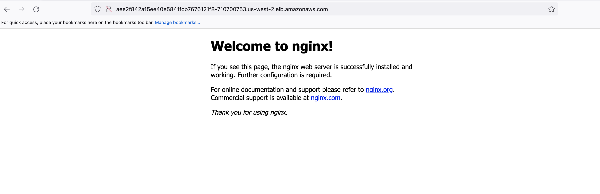

# kOps


## Installation

This project used [adsf](http://asdf-vm.com/manage/configuration.html#tool-versions) to provision the appropriate tooling and uses a [.tool-versions](.tool-versions) file to explicitly set the versions.

```shell
asdf install
```

This will install kops, awscli and jq. **Note** that jq is used to parse the response from some of the aws commands, it is therefore assumed that your credential file is set up to output json

```shell
cat ~/.aws/credentials
[your-profile]
output = json
region = us-west-2
aws_access_key_id = XXXXX
aws_secret_access_key = XXXXX
```

## Variables

The script includes a set of variables that can be overriden on the command line. See below for the list and an example.

```shell
: "${AWS_PROFILE:=default}"
: "${KOPS_USER:=kops}"
...
```

And an example of overriding some variables.

```sh
AWS_PROFILE=galileo S3_BUCKET_PREFIX=galileo ./script/kops-aws.sh -a -c
```

## Security Credentials

kOps uses the Go AWS SDK to register security credentials. This [AWS article](https://docs.aws.amazon.com/sdk-for-go/v1/developer-guide/configuring-sdk.html#specifying-credentials) describes how to configure settings for service clients.

In order to use kOps to build clusters in AWS we will create a dedicated IAM user for kOps.

The kOps user will require the following IAM permissions to function properly:

```
AmazonEC2FullAccess
AmazonRoute53FullAccess
AmazonS3FullAccess
IAMFullAccess
AmazonVPCFullAccess
AmazonSQSFullAccess
AmazonEventBridgeFullAccess
```

These policies will be attached to the IAM group in the script.

## Usage

```sh
kops-aws.sh - kOpS AWS Setup

    Usage: kops-aws.sh -h
           kops-aws.sh -a -c

      -h    show this help message
      -v    show Version
      -a    add the kOps user, group and bucket
      -c    create the cluster
      -t    create the terraform configuration
      -k    export kubecfg
      -d    delete the cluster
      -r    remove the kOps user, group and bucket

```

### Add the created resources

First time running this project you need to create the kOps IAM user and its group and to define the state bucket, run the following script, ensure that you bucket-prefix is globally unique.

```sh
AWS_PROFILE=<your-profile> S3_BUCKET_PREFIX=<bucket-prefix-globally-unique> ./script/kops-aws.sh -a
```

For debugging purposes, the output from the commands are stored in ./output folder, including the access-key created for the iam user.

After the user/group/bucket is created, then the cluster can be created.

### Create Kubernetes Cluster

**Note** In this example we will be deploying our cluster to the us-west-2 region.

```sh
AWS_PROFILE=<your-profile> S3_BUCKET_PREFIX=<bucket-prefix-globally-unique> ./scripts/kops-aws.sh -c
```

### Test the Kubernetes Cluster

Let us deploy a simple Nginx workload and see if you can load the website in a browser.

```sh
kubectl create deployment my-nginx --image=nginx --replicas=1 --port=80;
kubectl expose deployment my-nginx --port=80 --type=LoadBalancer;
```

Verify if the Nginx pods are running:

```sh
kubectl get pods
NAME                        READY   STATUS    RESTARTS   AGE
my-nginx-7576957b7b-wm95d   1/1     Running   0          7m10s
```

Get the Load Balancer (LB) address, **NOTE** it can take some time before the external ip is available:

```sh
kubectl get svc my-nginx
NAME       TYPE           CLUSTER-IP      EXTERNAL-IP                                                              PORT(S)        AGE
my-nginx   LoadBalancer   100.71.164.21   aee2f842a15ee40e5841fcb7676121f8-710700753.us-west-2.elb.amazonaws.com   80:31828/TCP   7m33s
```
Here, aee2f842a15ee40e5841fcb7676121f8-710700753.us-west-2.elb.amazonaws.com is the DNS name (endpoint) of the LB. Copy and paste it into a browser. You should see an Nginx default page:



The Kubernetes cluster is working as expected.

To clean up these resources:

```sh
kubectl delete svc my-nginx;
kubectl delete deploy my-nginx;
```

### Delete Kubernetes Cluster

**Note** In this example we will be deploying our cluster to the us-west-2 region.

```sh
AWS_PROFILE=<your-profile> S3_BUCKET_PREFIX=<bucket-prefix-globally-unique> ./scripts/kops-aws.sh -d
```

### Remove the created resources

When you no longer need kOps you can delete the kOps IAM user, group and bucket by running the following script

```sh
AWS_PROFILE=<your-profile> S3_BUCKET_PREFIX=<bucket-prefix-globally-unique> ./scripts/kops-aws.sh -r
```
